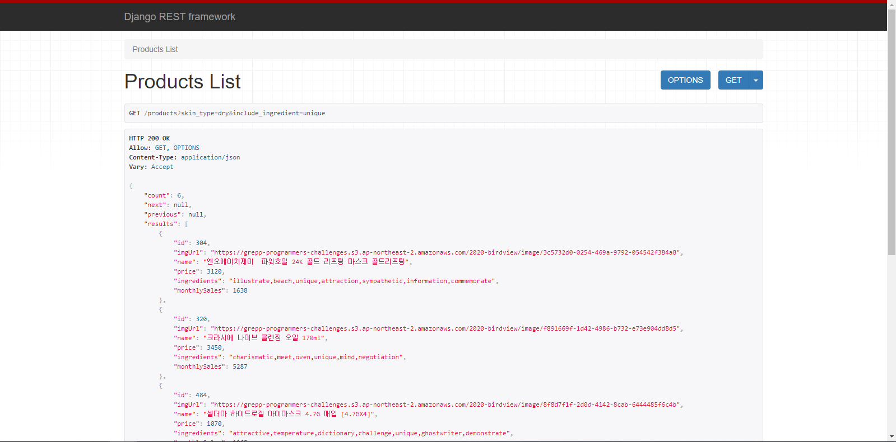
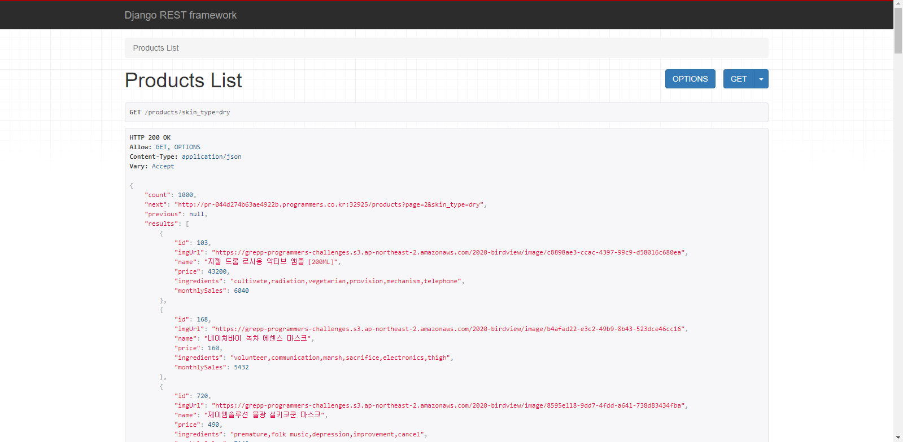
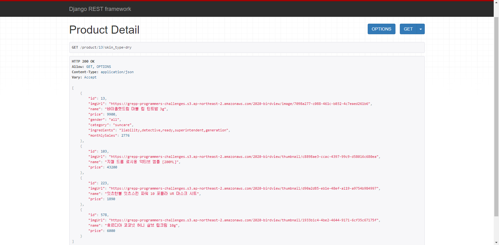

# programmers 과제 테스트 템플릿 - Django
홈페이지의 경우에는 처음 제공된 상태와 동일하며 과제를 받았을 때 소개된 URL을 사용하여 API에 원하는 정보를 요청할 수 있습니다.
사용법은 아래 링크에 연결된 WIKI를 통해서도 확인하실 수 있습니다.
또한, tests.py에 대한 설명 또한 WIKI에서 확인하실 수 있습니다.
## [API 사용법](./wiki/API-사용법)
## [tests.py에 대한 설명](./wiki/tests.py-사용법)
## API 사용 장면
### 여러개의 성분을 필수로 포함하는 상품 목록에 대한 response

### page를 확인할 수 있는 정보

### 상품 상세 정보 조회

